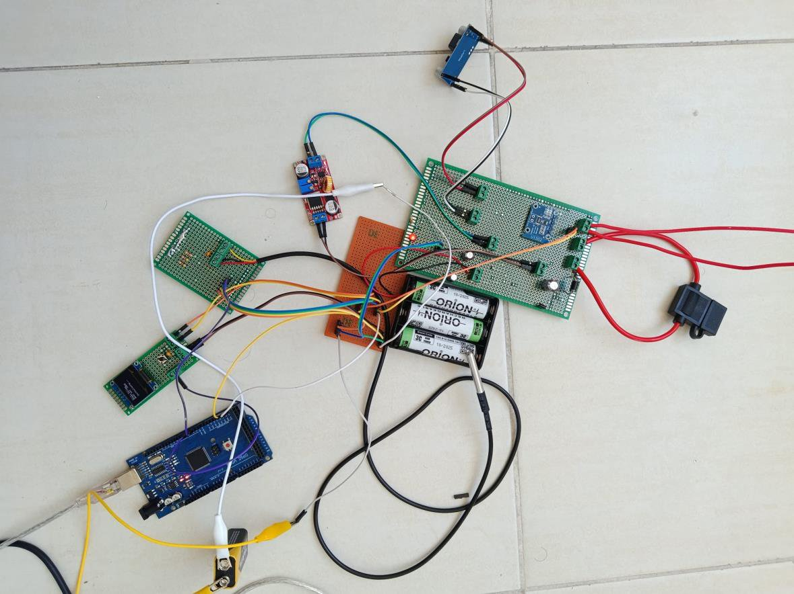
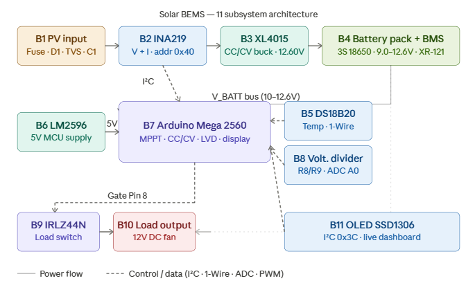
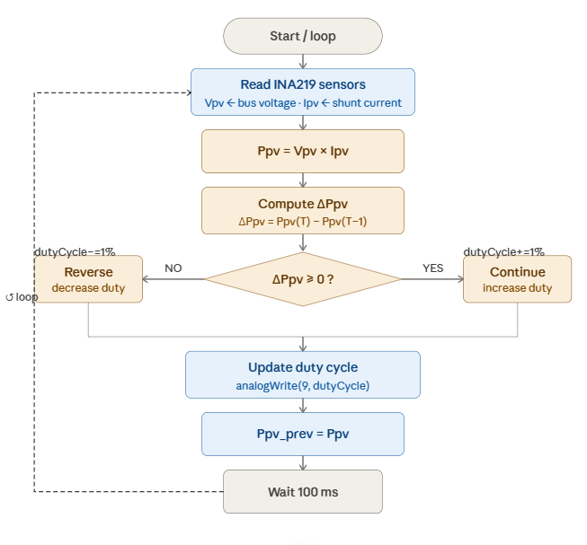
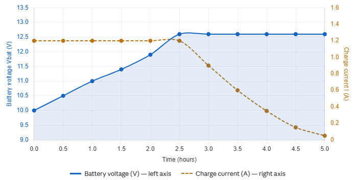
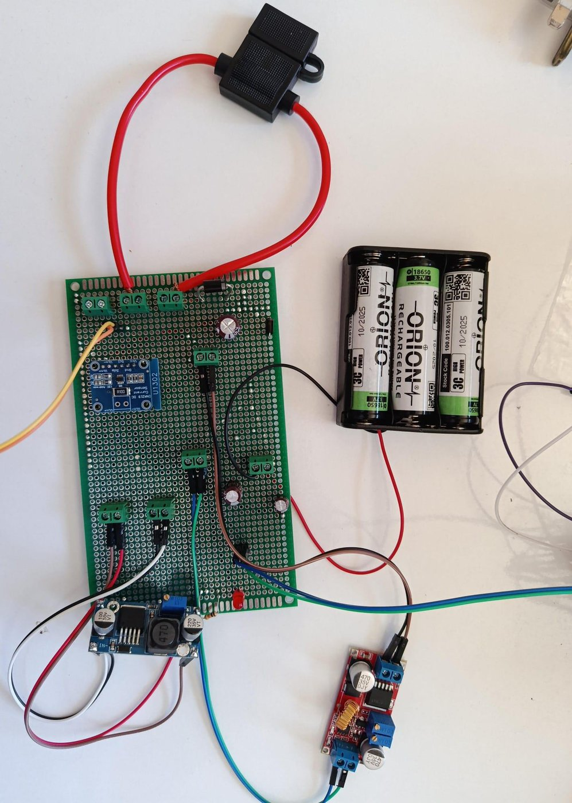
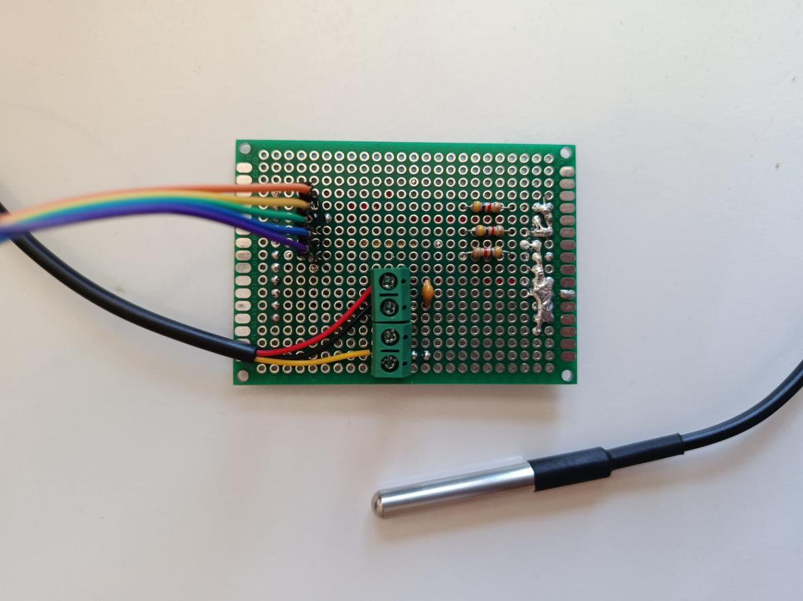
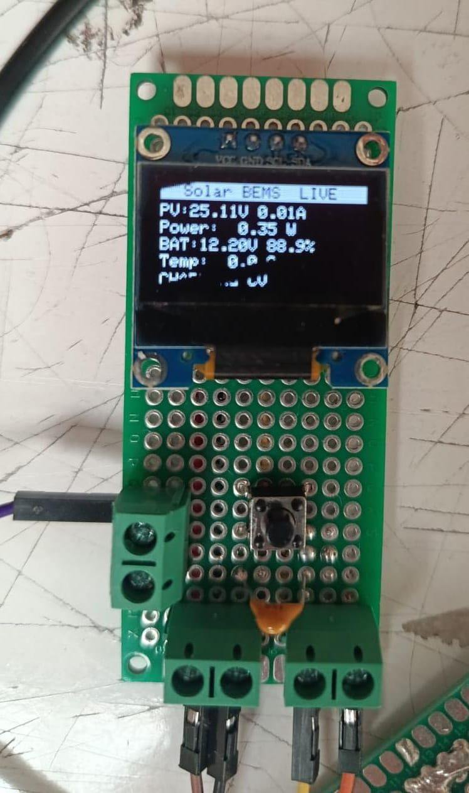
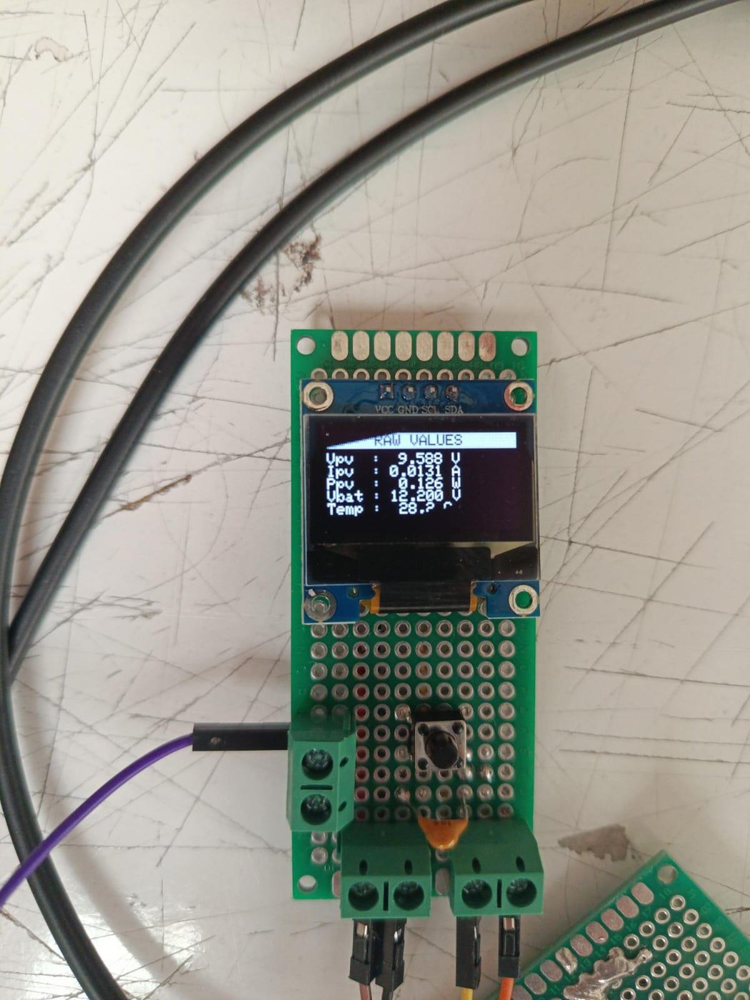
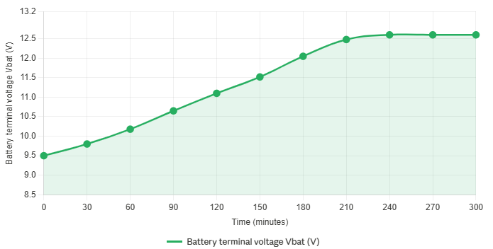

<div align="center">

# ☀️🔋 Solar BEMS

### Solar Panel-Based Battery Energy Management System

An embedded, Arduino Mega 2560-controlled off-grid solar charging system featuring
**P&O MPPT**, **CC/CV lithium-ion charging**, **State-of-Health estimation**, thermal
protection, and a live OLED dashboard — built on a three-board perfboard assembly.

[](https://www.arduino.cc/)
[](firmware/SolarBEMS/SolarBEMS.ino)
[](#-how-it-works)
[](#-how-it-works)
[](LICENSE)
[](https://www.arel.edu.tr/)

<br/>



*Complete Solar BEMS — three perfboards, Arduino Mega 2560, 3S 18650 pack, and protection.*

</div>

---

## 📖 Overview

**Solar BEMS** is a complete, deployable off-grid solar energy management system developed
as a Bachelor's graduation project in Electrical & Electronics Engineering at Istanbul Arel
University. It integrates a **25 Wp monocrystalline PV panel** with a **3-cell series (3S)
lithium-ion battery pack**, all managed by an **Arduino Mega 2560**.

The system maximizes harvested solar energy with a Perturb-and-Observe Maximum Power Point
Tracking (MPPT) algorithm, regulates battery charging through a hardware Constant
Current / Constant Voltage (CC/CV) profile, protects the cells with thermal and
low-voltage-disconnect safeguards, estimates State-of-Health via Coulomb counting, and
displays every parameter live on an OLED instrument panel.

It addresses the core weakness of cheap commercial solar charge controllers — no MPPT, no
real-time monitoring, no proper Li-ion management — in a single self-contained
microcontroller platform suitable for off-grid electrification, remote telecom power,
greenhouse automation, and educational demonstration.

> **Validation note:** the system was validated on the bench using a calibrated power supply
> set to **20.84 V / 1.23 A** — emulating the panel's maximum-power point (V<sub>mp</sub>)
> under Standard Test Conditions. Outdoor testing with the physical panel is the planned next
> deployment step.

---

## ✨ Features

| Capability | Description |
| --- | --- |
| **P&O MPPT** | Perturb-and-Observe tracking on a 100 ms loop; ±1 % duty-cycle steps; converges to V<sub>mp</sub> within ~3 cycles |
| **CC/CV charging** | Hardware-regulated XL4015 (12.60 V full, 1.20 A limit) supervised by a firmware state machine |
| **Real-time power sensing** | INA219 over I²C measures V<sub>PV</sub>, I<sub>PV</sub>, and computes P<sub>PV</sub> |
| **Thermal protection** | DS18B20 probe; immediate FAULT shutdown above 45 °C with 5 °C recovery hysteresis |
| **Low-Voltage Disconnect** | Load cut at 9.0 V, reconnect at 11.0 V (2.0 V hysteresis) to prevent deep discharge |
| **SoH estimation** | Coulomb counting integrated over the charge cycle |
| **Live OLED dashboard** | SSD1306 0.96″ display with multi-page views + serial telemetry @ 115200 baud |
| **Modular hardware** | Three independently-tested perfboards; all modules socketed for replacement |

---

## 🧭 System Architecture

The Solar BEMS is a power-conversion chain with a parallel instrumentation-and-control
layer. Energy flows from the PV source through protection, sensing, and conversion stages to
the battery and load, while the Arduino reads sensors and drives actuators in a 100 ms
state-machine loop. The design is organized into **11 functional subsystems**.

<div align="center">

</div>

| # | Subsystem | Role |
| --- | --- | --- |
| B1 | PV Input & Protection | Fuse, reverse-polarity diode, TVS surge clamp, bulk capacitance |
| B2 | INA219 Power Sensing | In-line PV voltage & current measurement (I²C `0x40`) |
| B3 | XL4015 CC/CV Buck | Steps PV voltage down to charge the pack (12.60 V) |
| B4 | Battery Pack + BMS | 3S 18650 Li-ion with XR-121 protection module |
| B5 | DS18B20 Temperature | 1-Wire battery-pack temperature sensing |
| B6 | LM2596 5 V Supply | Regulated 5 V rail for the MCU and peripherals |
| B7 | Arduino Mega 2560 | Central controller — MPPT, CC/CV, LVD, display |
| B8 | Voltage Divider | Scales battery voltage for the Arduino ADC (A0) |
| B9 | IRLZ44N Load Switch | Logic-level MOSFET for electronic load control |
| B10 | Load Output | 12 V DC fan (ventilation/thermal demo load) |
| B11 | SSD1306 OLED | Real-time parameter display (I²C `0x3C`) |

---

## ⚙️ How It Works

### Maximum Power Point Tracking (P&O)

A PV module's power–voltage curve has a single peak whose position drifts with irradiance and
temperature. The firmware periodically perturbs the converter duty cycle and observes the
resulting change in PV power (ΔP):

- **ΔP ≥ 0** → keep moving the duty cycle in the same direction (+1 %)
- **ΔP < 0** → reverse direction (−1 %)

The operating point oscillates tightly around the MPP in steady state. Below 5 V PV
(night/cloud), MPPT is bypassed and the system enters NIGHT mode.

<div align="center">

</div>

### CC/CV Lithium-Ion Charging

Li-ion charging requires a two-phase protocol enforced by the XL4015's hardware trim pots and
supervised in firmware:

| Phase | Condition | Behaviour |
| --- | --- | --- |
| **Constant Current (CC)** | V<sub>BAT</sub> < 11.5 V | Current held at the ~1.20 A set limit |
| **Constant Voltage (CV)** | 11.5 V ≤ V<sub>BAT</sub> < 12.6 V | Voltage clamped at 12.60 V; current tapers |
| **Float / Idle** | V<sub>BAT</sub> ≥ 12.6 V | Charging suspended |
| **LVD (disconnect)** | V<sub>BAT</sub> < 9.0 V | Load disconnected |
| **LVD (reconnect)** | V<sub>BAT</sub> > 11.0 V | Load reconnected (2.0 V hysteresis) |

<div align="center">

</div>

### Firmware State Machine

The Arduino firmware runs a 100 ms loop with four sequential phases —
**sensor reading → safety evaluation → control action → display update**. Thermal protection
has the highest priority and preempts everything else.

```
FAULT     Temp > 45 °C ............ all switches OFF immediately (highest priority)
NIGHT     Vpv < 5 V .............. no solar; load management only
MPPT_CC   solar present, Vbat < 11.5 V .. constant-current charging
MPPT_CV   solar present, 11.5–12.6 V ... constant-voltage charging
FLOAT     Vbat ≥ 12.6 V .......... charging suspended
LOAD_OFF  Vbat < 9.0 V ........... LVD active, load disconnected
LOAD_ON   Vbat > 11.0 V .......... load reconnected
```

The complete control-logic flowchart is in [`images/figB1_firmware_flowchart.png`](images/figB1_firmware_flowchart.png).

---

## 🔌 Hardware

The system is built on three double-sided perfboards (2.54 mm pitch) with colour-coded
24 AWG signal wiring and bare tinned-wire power bus rails. All converter modules are mounted
on pin-header sockets so they can be swapped without desoldering.

| Board | Size | Contents |
| --- | --- | --- |
| **Board 1 — Power Stage** | 9 × 15 cm | XL4015 charger, LM2596 5 V supply, INA219, fuse/diode/TVS protection, IRLZ44N load switch, screw terminals |
| **Board 2 — Sensor Hub** | 5 × 7 cm | I²C pull-up network (R1, R2), DS18B20 pull-up (R5) and probe connector |
| **Board 3 — Display Panel** | 3 × 7 cm | SSD1306 OLED, mode pushbutton + debounce cap |

<div align="center">



</div>

<div align="center">
<em>Left to right: Board 1 (power stage) · Board 2 (sensor hub) · Board 3 (display, OLED live).</em>
</div>

📋 **Full component list:** [`hardware/bill-of-materials.md`](hardware/bill-of-materials.md)
&nbsp;·&nbsp; 📌 **Pin assignments:** [`hardware/pin-assignments.md`](hardware/pin-assignments.md)
&nbsp;·&nbsp; 🧩 **Perfboard layout:** [`hardware/perfboard-layout.md`](hardware/perfboard-layout.md)

### Interactive Schematic

A **pin-level interactive schematic** (40+ components, 80+ annotated connections across all 11
subsystems) is included as a standalone HTML file. Hover any component to see its full spec and
engineering justification.

➡️ Open [`hardware/schematic/index.html`](hardware/schematic/index.html) in any modern browser —
no installation required. See [`hardware/schematic/README.md`](hardware/schematic/README.md) for
an important note on the schematic's design generation.

---

## 💻 Firmware

The firmware is a single Arduino sketch: [`firmware/SolarBEMS/SolarBEMS.ino`](firmware/SolarBEMS/SolarBEMS.ino).

### Pin map (Arduino Mega 2560)

| Mega Pin | Function | Mode |
| --- | --- | --- |
| `2` | DS18B20 data (1-Wire) | INPUT |
| `3` | Mode pushbutton | INPUT_PULLUP |
| `8` | IRLZ44N gate (load switch) | OUTPUT |
| `9` (PWM) | XL4015 EN — MPPT duty cycle | OUTPUT (PWM) |
| `20` (SDA) | I²C data — INA219 `0x40` + OLED `0x3C` | I²C |
| `21` (SCL) | I²C clock | I²C |
| `A0` | Battery voltage (R8/R9 divider) | ANALOG IN |
| `5V` / `GND` | Power from LM2596 / common ground | — |

### Required libraries

Install these through the Arduino IDE **Library Manager**:

- `Adafruit_INA219`
- `Adafruit_SSD1306`
- `Adafruit_GFX`
- `OneWire`
- `DallasTemperature`
- `Wire` (built-in)

### Upload

1. Open `firmware/SolarBEMS/SolarBEMS.ino` in the Arduino IDE.
2. Select **Tools → Board → Arduino Mega or Mega 2560** and the correct serial port.
3. Install the libraries listed above.
4. Click **Upload**. Open the Serial Monitor at **115200 baud** to view live telemetry.

> ⚠️ **Safety:** never connect the battery before verifying the XL4015 output is set to
> **12.60 V** and the current limit to **~1.20 A** against a resistive dummy load with a
> multimeter. Li-ion cells are unforgiving of over-voltage.

---

## 📊 Results

Bench validation results (power supply emulating the PV source at V<sub>mp</sub>):

| Parameter | Measured | Target | Result |
| --- | --- | --- | --- |
| LM2596 5 V rail | 5.00 V | 5.00 ± 0.05 V | ✅ PASS |
| XL4015 output voltage | 12.60 V | 12.60 V | ✅ PASS |
| INA219 I²C detection | `0x40` found | `0x40` | ✅ PASS |
| DS18B20 accuracy | ±0.8 °C | ±1 °C | ✅ PASS |
| LVD disconnect | 9.02 V | 9.00 V | ✅ PASS |
| LVD reconnect | 11.05 V | 11.00 V | ✅ PASS |
| SoH (Coulomb counting) | 89.2 % (2140 mAh) | tracked vs nominal | ✅ PASS |
| MPPT convergence | < 3 cycles | stable at V<sub>mp</sub> | ✅ PASS |

The MPPT algorithm converged to V<sub>mp</sub> within three control cycles from a cold start;
CC→CV transition occurred at the programmed 11.5 V threshold and the charge voltage stabilized
at 12.60 V.

<div align="center">


</div>

<div align="center">
<em>Left: live OLED instrument panel. Right: battery voltage vs. time showing CC→CV transition.</em>
</div>

---

## 📂 Repository Structure

```
solar-bems/
├── README.md                      ← you are here
├── LICENSE                        ← MIT license
├── .gitignore
├── firmware/
│   └── SolarBEMS/
│       └── SolarBEMS.ino          ← Arduino Mega 2560 firmware
├── hardware/
│   ├── bill-of-materials.md       ← full component list (as-built)
│   ├── pin-assignments.md         ← Mega 2560 pin map
│   ├── perfboard-layout.md        ← three-board layout & bus rails
│   ├── Solar_BEMS_BOM.xlsx        ← detailed procurement workbook
│   └── schematic/
│       ├── index.html             ← interactive pin-level schematic
│       └── README.md
├── docs/
│   ├── Solar_BEMS_Thesis.pdf      ← full graduation thesis
│   ├── Solar_BEMS_Presentation.pptx
│   └── README.md
└── images/                        ← figures & hardware photographs
```

---

## 🚀 Getting Started

```bash
# 1. Clone the repository
git clone https://github.com/ahmed-salama7/solar-bems.git
cd solar-bems

# 2. Open the interactive schematic to explore the hardware
#    (double-click, or:)
xdg-open hardware/schematic/index.html      # Linux
open hardware/schematic/index.html          # macOS
start hardware/schematic/index.html         # Windows

# 3. Open the firmware in the Arduino IDE
#    firmware/SolarBEMS/SolarBEMS.ino
```

Then follow the [firmware upload steps](#-firmware) above.

---

## 🗺️ Roadmap / Future Work

- [ ] **Battery-side current sensing** — add a second INA219 at `0x41` on the battery bus for accurate discharge-side Coulomb counting
- [ ] **Outdoor PV testing** — connect and validate with the physical 25 Wp panel
- [ ] **Active cell balancing** — beyond the BMS's passive balancing for longer pack life
- [ ] **Custom KiCad PCB** — replace perfboard to minimize switching-loop parasitics
- [ ] **IP65 enclosure** — weatherproofing with cable glands for field deployment

---

## 📚 References

Key references from the thesis (full list in [`docs/Solar_BEMS_Thesis.pdf`](docs/Solar_BEMS_Thesis.pdf)):

1. IEA, *Renewables 2022: Analysis and Forecasts to 2027*, 2022.
2. B. Scrosati & J. Garche, "Lithium batteries: Status, prospects and future," *J. Power Sources*, 2010.
3. N. Femia et al., "Optimization of perturb and observe MPPT method," *IEEE Trans. Power Electron.*, 2005.
4. XLSEMI, *XL4015E1 5A 180KHz 36V Buck Converter* datasheet.
5. Texas Instruments, *INA219 Bidirectional Current/Power Monitor* (SBOS448G).
6. Maxim Integrated, *DS18B20 1-Wire Digital Thermometer* datasheet.

---

## 👤 Author

**Ahmed Salama**
B.Sc. Electrical & Electronics Engineering — Istanbul Arel University (2022–2026)
Supervisor: **Dr. Oben Dağ**

> If you use or reference this project academically, a citation of the thesis
> (*Solar Panel-Based Battery Energy Management System*, Istanbul Arel University, 2026) is appreciated.

## 📝 License

This project is released under the **MIT License** — see [LICENSE](LICENSE). The accompanying
thesis and presentation in `docs/` are the author's academic work; please cite them if reused.
