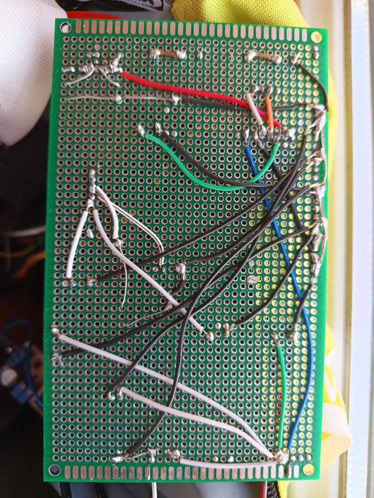
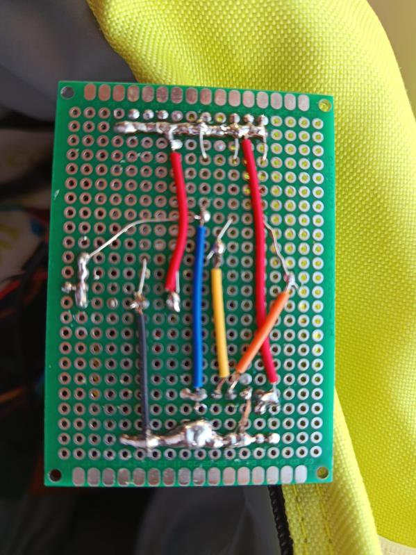
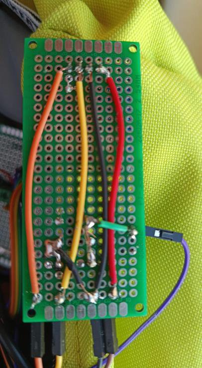

# Perfboard Layout

The Solar BEMS is built on **three double-sided perfboards** (2.54 mm pitch). High-current
connections run on the solder side using bare tinned-wire bus rails; signal connections use
colour-coded 24 AWG wire. Converter modules sit on pin-header sockets for tool-free
replacement.

---

## Board 1 — Power Stage (9 × 15 cm)

Houses all high-current power electronics, laid out left-to-right along the power-flow path:

```
PV input → protection → sensing → conversion → battery bus → 5V supply → load switch → terminals
```

**Four bus rails are laid before any components:**

| Rail | Location |
| --- | --- |
| GND spine | Column 2, full board length (rows 1A–3B) |
| +V_PV rail | Row 1E, columns 25–31 |
| V_BATT spine | Column 28 (rows 2E–2S) |
| +5V_MCU rail | Row 3A, columns 4–20 |

**Key placement decisions**

- The **IRLZ44N** is positioned with its heatsink tab outward and a clip-on aluminium heatsink, since the fan can draw up to 0.5 A.
- The **flyback diode D4 (1N4007)** sits directly adjacent to the MOSFET drain–source to minimize the inductive loop area.
- The **XL4015** and **LM2596** modules are socketed on 2.54 mm headers for replacement without desoldering.
- The **voltage divider (R8, R9, C14)** is placed close to the Arduino header to keep the low-level analogue signal wire to A0 short.

<div align="center">


</div>
<div align="center"><em>Board 1 — component side (left) and solder side (right).</em></div>

---

## Board 2 — Sensor & Signal Board (5 × 7 cm)

Provides the I²C pull-up network and the DS18B20 probe interface.

- **R1, R2 (4.7 kΩ)** — SDA and SCL pull-ups; the **only** I²C pull-ups in the entire system.
- **R5 (4.7 kΩ)** — DS18B20 DQ pull-up to +5 V, required by the 1-Wire protocol.
- **3-pin header** accepts the waterproof DS18B20 probe cable (VDD, DQ, GND).

<div align="center">


</div>
<div align="center"><em>Board 2 — component side (left) and solder side (right).</em></div>

---

## Board 3 — Display & Interface Board (3 × 7 cm)

Carries the OLED and the mode-selection control.

- **SSD1306 OLED** on a 4-pin header, oriented to face outward for an instrument-panel look.
- **Mode pushbutton** between Arduino pin 3 (INPUT_PULLUP) and GND, with a 100 nF debounce cap. A short press toggles between monitoring and battery-characterisation modes.

<div align="center">


</div>
<div align="center"><em>Board 3 — display side with OLED live (left) and solder side (right).</em></div>

---

## Detailed hole-by-hole map

Coordinates use `[band][row][column]` notation (band 1 = top third, band 2 = middle third,
band 3 = bottom strip for Board 1; Boards 2 and 3 use single-letter rows A–X and numeric
columns). The complete hole-by-hole connection tables — each entry specifying component
reference, pin name, hole coordinate, and the solder-side connection — are documented in the
build guide (Appendix E of the [thesis](../docs/Solar_BEMS_Thesis.pdf)).
